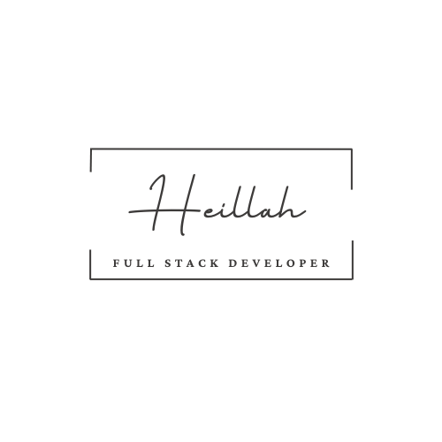

<!--
**Heillah/Heillah** is a ✨ _special_ ✨ repository because its `README.md` (this file) appears on your GitHub profile.

Here are some ideas to get you started:

- 🔭 I’m currently working on ...
- 🌱 I’m currently learning ...
- 👯 I’m looking to collaborate on ...
- 🤔 I’m looking for help with ...
- 💬 Ask me about ...
- 📫 How to reach me: ...
- 😄 Pronouns: ...
- ⚡ Fun fact: ...
-->

  

###
###

<h1 align="center">Hey there 👋</h1>

###

<h3 align="left">👩‍💻  About Me</h3>

###

- 🔭 I’m currently working on: Software solutions to help doctors go paperless and enable seamless online claim submissions. - 👯 I’m looking to collaborate on: Projects that focus on Angular, React, C# applications, or efficient workflow automation. - 🤔I’m looking for help with: Nx monorepos, especially in creating scalable and maintainable architectures. - 🌱 I’m currently learning: AWS and Google Cloud services and tools to enhance cloud-based deployments and solutions. - 💬 Ask me about: Africa, its diverse cultures, and opportunities in technology across the continent. - ⚡ In my free time I like to travel.

###

<picture>
  <source media="(prefers-color-scheme: dark)" srcset="https://raw.githubusercontent.com/Heillah/Heillah/output/github-snake-dark.svg" />
  <source media="(prefers-color-scheme: light)" srcset="https://raw.githubusercontent.com/Heillah/Heillah/output/github-snake.svg" />
  
</picture>

###

<h3 align="left">🛠 Language and tools</h3>

###

  
  
  
  
  
  
  
  
  
  
  
  
  
  
  
  
  
  
  
  
  
  
  
  
  
  
  
  
  
  
  
  
  
  
  
  
  
  
  
  
  
  
  

###

<h3 align="left">🔥   My Stats :</h3>

###

  
  

###
